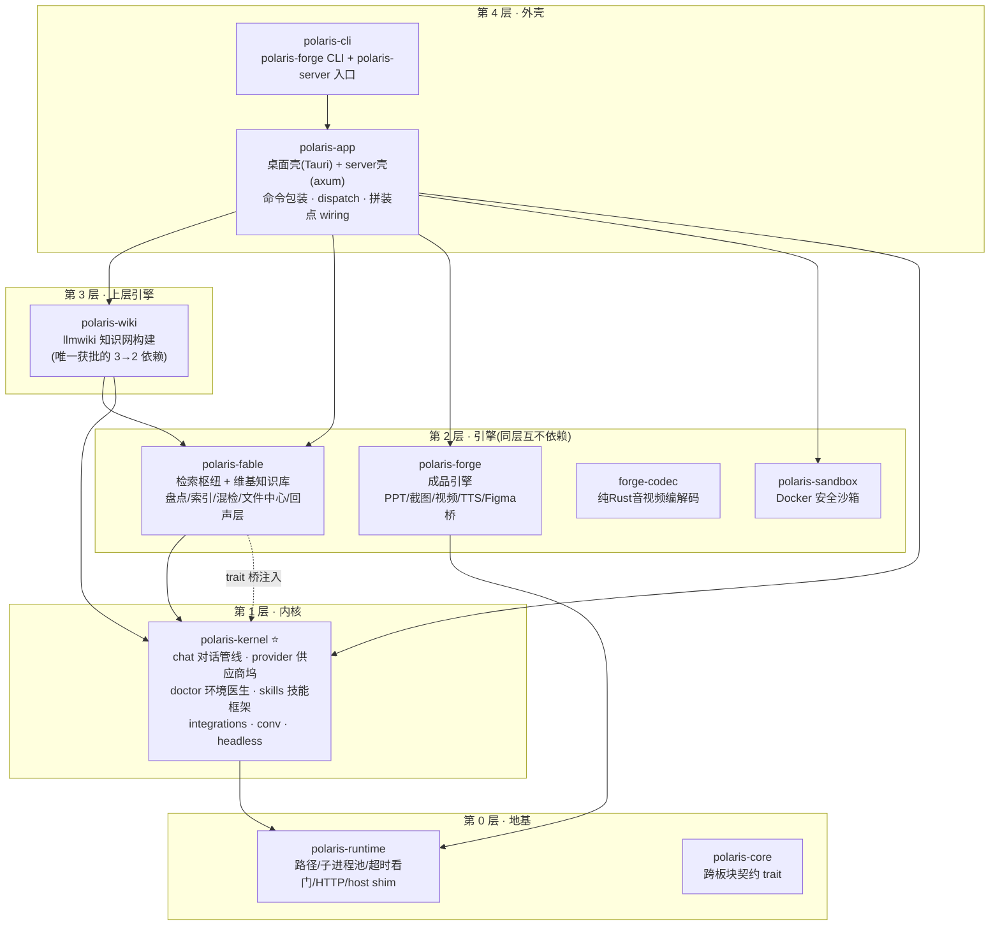

<div align="center">

# 北极星 · Polaris

### 愿北极星能够照亮你前路的所有黑暗，在混乱的时代坚守本心

**本地优先的 AI 工作台** · 墨蓝水墨风 · Tauri 2 + Vue 3 + Rust

<br>


</div>

---

## ✨ 这是什么

Polaris 是一个**跑在你自己电脑上**的 AI 工作台。它把 Claude Code 的对话能力、SQLite 落盘的本地检索枢纽、自动生长的 llmwiki 知识网、PPT / 视频 / 网页成品渲染引擎、可插拔的技能系统、百人专家团、多家 API 供应商一键切换、语音输入、多人协作，收进同一个墨蓝水墨风的应用里——桌面、Docker/NAS、手机三种外壳共用同一份引擎源码。

你的对话、知识、生成的成品，全部安放在本地的「工作文件夹」中——**数据始终是你的**。

> 启动时会有一页北极星夜空作引，首次使用会引导你安顿好工作文件夹（默认 `~/Polaris/PolarisKB`）。

---

## 🧱 积木架构 · 想要什么，拼什么

Polaris 不是一块铁板，而是一套 **Cargo workspace 里的 10 块积木**。板块之间的边界不靠口头约定，靠编译器物理保证：引擎互相不认识，联动一律由壳层编排；内核对引擎的需要走 trait 桥注入，未注入时优雅降级。



**边界铁律**（编译器强制，违反直接编不过）：

- 依赖只许**向下**，同层引擎禁止互引——`fable` 里 `use polaris_forge::…` 是编译错误，不是 code review 意见；
- 内核不认识任何引擎：chat 对检索（kb/fable）与专家团的全部需要收口于 `chat::bridges` 的 `KbBridge`/`ExpertBridge` trait，由壳层 `wiring.rs` 启动时注入——**不装某个引擎，内核照样编译运行**，对应能力静默降级；
- 运行时零开销：workspace 内静态链接 + 壳仓 release profile `lto = true, codegen-units = 1`，crate 边界对优化器透明——拆前拆后机器码等价。

### 积木清单

| 积木 | 层 | 装什么 | 独立编译 |
|------|----|--------|:---:|
| `polaris-kernel` ⭐ | 内核 | chat 对话管线（headless `claude` CLI 驱动、流式渲染、产物护栏）· provider 供应商坞 + OAuth · doctor 环境医生 · skills 技能框架 · integrations（飞书/企微/NAS）· conv 项目对话存储 · convert 万格式转 Markdown | ✅ |
| `polaris-fable` | 引擎 | 检索枢纽（全盘盘点 / 向量+词法混检 / SQLite 落盘）· 维基知识库（双链图谱/拖拽入库）· 文件中心 · 回声层（对话蒸馏/每日做梦/晨报）· 感官坞 | ✅ |
| `polaris-forge` | 引擎 | deck→PPTX / spec→原生可编辑 PPTX / 持久 CDP 截图 / 视频合成 / TTS / Figma 往返桥 | ✅ |
| `polaris-wiki` | 上层引擎 | llmwiki 知识网构建管线：摄入即编译，LLM 抽实体/概念、写 wiki 词条、结双链成网 | ✅ |
| `polaris-collab`* | 引擎 | 多人协作：账号/任务卡/合并闸门/iroh 隧道/云中继（*当前在壳仓 `src/collab`，Phase 2 抽出） | — |
| `forge-codec` | 引擎 | 纯 Rust 音视频编解码（openh264 + 自写 BMFF muxer + ebur128 + symphonia），替 ffmpeg CLI | ✅ |
| `polaris-sandbox` | 引擎 | Docker 安全沙箱（轻量镜像 + docker CLI 包装），经 `polaris-core::KbLocator` 反转依赖 | ✅ |
| `polaris-runtime` | 地基 | 路径单源 / 子进程池与超时看门 / HTTP 构造 / 双壳事件 host shim——不依赖 tauri、不认识任何业务板块 | ✅ |
| `polaris-core` | 地基 | 跨板块契约 trait（依赖反转的落点） | ✅ |
| `polaris-cli` | 外壳 | `polaris-forge`（渲染引擎 CLI，给 agent/脚本/Docker 直调）与 `polaris-server`（Docker 服务端入口） | ✅ |

---

## 🔌 组件取用 · 三种姿势

### 1. 整装 · 桌面 / 服务端 / CLI

```powershell
npm run tauri:build                                      # 桌面安装包（NSIS / dmg）
cargo build -p polaris-cli --release                     # 产物: polaris-forge.exe + polaris-server.exe
cargo build --release --no-default-features --features server   # server 壳(axum, 无 tauri, Docker 用)
```

### 2. 按积木下载 · Cargo git 依赖

每块积木都是独立 crate，可以直接从本仓按包名拉走（钉 rev/tag，Phase 2 分仓后切独立仓库地址，包名不变）：

```toml
[dependencies]
# 只要检索引擎:全盘盘点 + 混合检索 + SQLite 索引
polaris-fable = { git = "https://github.com/wuli2025/polaris_coworker", package = "polaris-fable" }

# 只要成品引擎:deck→PPTX / 截图 / 视频 / TTS
polaris-forge = { git = "https://github.com/wuli2025/polaris_coworker", package = "polaris-forge" }

# 内核 + 检索 + 知识网 = 一个「自动生长的个人维基」
polaris-kernel = { git = "https://github.com/wuli2025/polaris_coworker", package = "polaris-kernel" }
polaris-wiki   = { git = "https://github.com/wuli2025/polaris_coworker", package = "polaris-wiki" }
```

极简拼装是真的能跑：只装 `polaris-kernel` 时不注入检索桥，KB 召回/专家路由静默跳过，对话核心照常工作。

### 3. feature 开关 · 同一份源码的多形态

| feature | 作用 | 默认 |
|---------|------|:---:|
| `desktop` | Tauri 外壳 + 各插件 + 沙箱 + 协作主机（各积木的 desktop 特性随之联动开启） | ✅ |
| `server` | axum HTTP/WS 外壳，复用全部引擎，不拉 tauri（Docker/NAS 用） | — |
| `local-embed` | 本地 ONNX 嵌入/重排（BGE-M3），检索不走网络、无 API 限速 | — |
| `voice-asr` / `voice-live` | 本地 SenseVoice 语音识别核 / 实时语音输入（热键+注入+AI 整形） | — |
| `collab-net` | iroh QUIC 打洞 + relay 兜底的多人协作组网隧道 | — |

> 所有形态均在 CI 口径下验证：`cargo check` 双 flavor、每积木 default 与 desktop 两形态独立编译、三段式单测（见下）。

---

## 🖼 一眼看懂

### 对话核心 · 你说，北极星画

直接驱动 `claude` CLI（宿主或沙箱内），stream-json 逐字流式渲染。底部一行选技能、挂知识库、切四档授权。

<p align="center"></p>

### 技能中心 · 即装即用

深度搜索、Skill 创建向导、PDF / Excel、语音合成、视频动画、联网搜索、AI 生图、CloakBrowser 浏览器……技能即 prompt 注入，支持一键安装与外部导入（git / url / zip）。

<p align="center"></p>

### 成品实时预览 + Figma 级编辑器

对话生成的 HTML / 图表 / 文档，直接在右侧抽屉渲染；成品编辑器支持图层树、多选框选对齐、吸附参考线、Figma 往返桥。

<p align="center"></p>

### AI 协作伙伴 · WorkBuddy 实战

把一个真实任务交给它——它会自己检索、整理、交叉验证，并产出一份可直接打开的报告。这才是工作台的意义：不止聊天，而是把活干完。

<p align="center"></p>

### API 供应商坞 · 点选即切换

Claude 官方、智谱、DeepSeek、火山方舟、Gemini、聚合站……点一下完成切换，每对话可各用各的 API，底部实时显示当日用量。

<p align="center"></p>

### 知识库 · 浏览、拖拽入库与星河图谱

任意格式拖进来自动转 Markdown 归档；文档按双链 `[[wiki-link]]` 派生连通，以发光星图呈现。

<p align="center"></p>
<p align="center"></p>

### CLAUDE.md 主上下文

每个项目 + 知识库各持一份 `CLAUDE.md` 主上下文，可视化编辑、按需激活，决定每次对话注入什么。

<p align="center"></p>

---

## 🧩 核心能力

| 板块 | 能力 |
|------|------|
| 对话核心 | headless `claude` CLI 驱动，token 级流式，四档权限，看门狗防误杀，产物路径护栏 fail-closed |
| 检索枢纽 fable | 全盘盘点（工业级卷枚举/NAS 感知）→ SQLite 索引 → 向量+词法 RRF 混检；可选本地嵌入零网络 |
| llmwiki 知识网 | 摄入即编译：LLM 读原文抽实体/概念写词条、结双链；检索是读，它是写的那一半 |
| 成品引擎 forge | deck→PPTX、spec→原生可编辑 PPTX、持久 CDP 截图（6-10× 提速）、视频合成、TTS |
| 技能系统 | 技能=prompt 注入；预置 50+ 精选（开发/测试/财会/设计/自媒体），支持 git/url/zip 导入 |
| 百人专家团 | 69 位专家、24 组，智能路由/召集成队/分工注入，头像内嵌 |
| 供应商坞 | 多供应商一键切换 + Claude/Codex OAuth 回环一键授权 + 用量看板 + 余额查询 |
| 回声层 | 对话归档蒸馏、每日做梦沉淀、晨报卡片 |
| 语音输入 | 本地 SenseVoice 识别 + 热键按住说 + 个人词表防污染 + AI 整形（仿 Typeless） |
| 多人协作 | 桌面一键当主机、任务卡/合并闸门、iroh 隧道、云中继、手机壳接入 |
| 环境医生 | claude/node/pwsh/uv 检测与一键安装，国内镜像源 |
| 安全沙箱 | Docker 轻量镜像 + `KbLocator` 依赖反转挂载 KB |

---

## ⚙️ 前置依赖

| 工具 | 用途 |
|------|------|
| Node 20+ | 前端构建 (`npm`) |
| Rust 1.80+ | workspace 后端 |
| Docker Desktop | 沙箱镜像构建 / 运行（可选）|
| `claude` CLI | 对话核心调用（「环境医生」可一键装；国内可 `npm i -g @anthropic-ai/claude-code --registry=https://registry.npmmirror.com`）|

## 🚀 开发模式

```powershell
cd polaris-app
npm install          # 首次
npm run tauri:dev
```

Vite 端口固定 1421（与 `src-tauri/tauri.conf.json` 的 `devUrl` 一致）。

## 📦 打包安装版

```powershell
npm run tauri:build
```

产物在 `src-tauri/target/release/`：
- `polaris-app.exe` — 免安装可执行文件
- `bundle/nsis/Polaris_<ver>_x64-setup.exe` — NSIS 安装包

## ✅ 测试 · 三段式

```powershell
cd src-tauri
cargo test                                   # 壳仓(desktop flavor)
cargo test -p polaris-runtime -p polaris-kernel -p polaris-fable -p polaris-forge -p polaris-wiki
cargo test -p polaris-app --no-default-features --features server   # server flavor
```

> 勿用 `cargo test --workspace`：feature 统一会把 desktop + server 并开，是未验证组合。

## 📁 文件结构

```
polaris-app/
├── src/                          # Vue 3 主前端（三栏布局 / Pinia / 组件懒加载）
├── mobile/                       # 手机壳（Vue + 安卓原生容器）
├── src-tauri/                    # Rust workspace（10 crate）
│   ├── src/                      # polaris-app 壳:命令包装 + dispatch + wiring 拼装点
│   │   ├── lib.rs                #   入口 + generate_handler 注册(全别名保旧路径)
│   │   ├── wiring.rs             #   引擎实现注入内核桥(全仓唯一同时认识两侧的地方)
│   │   ├── server.rs             #   axum server 壳
│   │   ├── collab/ expert/ voice/#   待 Phase 2 抽出的板块
│   │   └── templates/            #   技能/专家/KB 模板(内容资产)
│   └── crates/
│       ├── polaris-core/         # 契约 trait
│       ├── polaris-runtime/      # 横切基建(路径/进程池/HTTP/host shim)
│       ├── polaris-kernel/       # ⭐ 内核(chat/provider/doctor/skills/integrations/conv)
│       ├── polaris-fable/        # 检索枢纽 + 维基知识库
│       ├── polaris-forge/        # 成品引擎(PPT/截图/视频/TTS)
│       ├── polaris-wiki/         # llmwiki 知识网构建
│       ├── forge-codec/          # 纯 Rust 音视频编解码
│       ├── polaris-sandbox/      # Docker 沙箱
│       └── polaris-cli/          # polaris-forge CLI + polaris-server 入口
├── docs/                         # 规划 PRD + 截图
└── README.md                     # 本文
```

## 🗺 规划与状态

- 板块规划 PRD：[`docs/planning/`](./docs/planning/)
- 分仓路线：Phase 0（仓内画线）与 Phase 1（workspace 抽 crate）已落地；Phase 2 起逐仓抽出（forge → collab → wiki → fable），组件包名与取用方式保持不变。

## 已知限制

- 浏览器模式（`npm run dev`）只能预览 UI，后端调用走 stub
- `/api/invoke` 对未知参数名静默容忍（契约层欠账，protocol 仓在 Phase 2 规划中）
- 沙箱 audit 流尚未接入右抽屉「沙箱日志」
